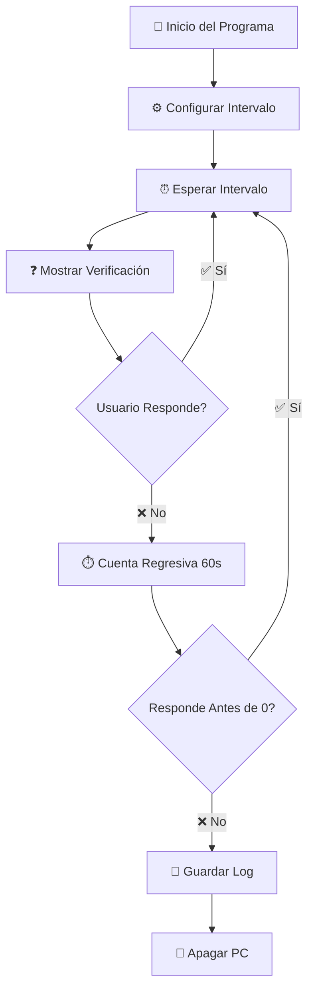

<div align="center">

# 🌱 Monitor de Inactividad - Ahorro de Energía 💡

### _¡Cuida el planeta mientras cuidas tu PC!_ 🌍


---

### 🎯 **Propósito Principal**

Este programa fue diseñado para **reducir el consumo energético** de tu ordenador detectando períodos de inactividad y apagándolo automáticamente cuando no está en uso. 

```
💰 Ahorra dinero → 🔌 Reduce consumo → 🌍 Protege el medio ambiente
```

</div>

---

## 📋 Tabla de Contenidos

- [✨ Características](#-características)
- [🎬 Demostración Visual](#-demostración-visual)
- [🔧 Requisitos y Dependencias](#-requisitos-y-dependencias)
- [💻 Instalación](#-instalación)
- [🚀 Uso](#-uso)
- [⚙️ Configuración](#️-configuración)
- [📊 Registro de Apagados](#-registro-de-apagados)
- [🌟 Beneficios Ambientales](#-beneficios-ambientales)
- [❓ Preguntas Frecuentes](#-preguntas-frecuentes)
- [🤝 Contribuir](#-contribuir)
- [📜 Licencia](#-licencia)

---

## ✨ Características

<table>
<tr>
<td width="50%">

### 🎨 Interfaz Moderna
- Diseño oscuro con acentos dorados
- Ventanas centradas automáticamente
- Bordes brillantes y animaciones visuales
- Interfaz intuitiva y fácil de usar

</td>
<td width="50%">

### ⚡ Funcionalidad Inteligente
- Intervalos de verificación personalizables
- Cuenta regresiva visual de 60 segundos
- Sistema de alertas progresivas
- Registro automático de apagados

</td>
</tr>
<tr>
<td width="50%">

### 🔒 Seguridad
- Confirmación antes del apagado
- Opción de cancelación en cualquier momento
- No requiere permisos de administrador
- Logs detallados de actividad

</td>
<td width="50%">

### 🌿 Ecológico
- Reduce consumo eléctrico innecesario
- Previene el sobrecalentamiento del PC
- Extiende la vida útil del hardware
- Contribuye a reducir tu huella de carbono

</td>
</tr>
</table>

---

## 🎬 Demostración Visual

### 📸 Capturas de Pantalla

#### 🔸 Ventana de Configuración Inicial
```
┌─────────────────────────────────────────────┐
│  ⚙️  Configuración del Monitor              │
│                                              │
│  Ingrese el intervalo en minutos para       │
│  verificaciones:                             │
│  (ej., 15 para cada 15 minutos)             │
│                                              │
│            ┌──────────┐                      │
│            │    30    │                      │
│            └──────────┘                      │
│                                              │
│    [Iniciar Monitor]  [Salir]               │
└─────────────────────────────────────────────┘
```

#### 🔸 Ventana de Verificación de Actividad
```
┌─────────────────────────────────────────────┐
│              ¿Sigues ahí?  👀                 │
│                                              │
│   ¡El ordenador se apagará si no respondes!  │
│                                              │
│                  60 ⏱️                       │
│                                              │
│         [¡Sí, estoy aquí!] 💛                │
│                                              │
│              [Salir] 🔴                      │
└─────────────────────────────────────────────┘
```

### 🎭 Flujo de Funcionamiento



---

## 🔧 Requisitos y Dependencias

### 🐍 Python

```python
# Versión mínima requerida
Python 3.7 o superior
```

### 📦 Bibliotecas Necesarias

El programa utiliza **únicamente bibliotecas estándar de Python**, por lo que **NO necesitas instalar paquetes adicionales**:

| Biblioteca | Versión | Propósito | Incluida en Python |
|------------|---------|-----------|-------------------|
| `tkinter` | ✓ | Interfaz gráfica (GUI) | ✅ Sí |
| `time` | ✓ | Manejo de temporizadores | ✅ Sí |
| `os` | ✓ | Operaciones del sistema | ✅ Sí |
| `sys` | ✓ | Funciones del sistema | ✅ Sí |
| `threading` | ✓ | Hilos para temporizador | ✅ Sí |
| `datetime` | ✓ | Registro de fechas/horas | ✅ Sí |

> 🎉 **¡Ventaja! ** No necesitas ejecutar `pip install` para nada. Todo viene incluido con Python.

### 💻 Sistema Operativo

```
🪟 Windows 7 / 8 / 10 / 11
```

> ⚠️ **Nota:** Este programa está diseñado específicamente para Windows, ya que utiliza el comando `shutdown` de Windows.

---

## 💻 Instalación

### 📥 Opción 1: Descarga Directa

1. **Descarga el archivo:**
   ```bash
   # Clona el repositorio o descarga el archivo directamente
   git clone https://github.com/tu-usuario/inactivity-monitor.git
   cd inactivity-monitor
   ```

2. **Verifica que tienes Python instalado:**
   ```bash
   python --version
   ```
   Deberías ver algo como:  `Python 3.x.x`

3. **¡Listo para usar!** 🎉

### 📥 Opción 2: Ejecutable (Próximamente)

Estamos trabajando en una versión ejecutable (`.exe`) que no requiere Python instalado.

---

## 🚀 Uso

### 🎯 Ejecución Básica

1. **Abre la terminal o símbolo del sistema** en la carpeta del programa

2. **Ejecuta el script:**
   ```bash
   python inactivity_monitor.py
   ```

3. **Configura el intervalo:**
   - Se abrirá una ventana solicitando el intervalo en minutos
   - Ingresa un número entre **1** y **1440** (24 horas)
   - Ejemplo: `30` para verificar cada 30 minutos

4. **Haz clic en "Iniciar Monitor"** 🟢

5. **El programa ahora está activo:**
   - Esperará el tiempo configurado
   - Mostrará una alerta preguntando si sigues ahí
   - Si respondes, el ciclo continúa
   - Si no respondes en 60 segundos, el PC se apagará

### 🛑 Detener el Programa

Puedes detener el programa de dos formas:

1. **Haciendo clic en "Salir"** en cualquier ventana
2. **Presionando `Ctrl + C`** en la terminal

---

## ⚙️ Configuración

### ⏰ Intervalos Recomendados

| Situación | Intervalo Sugerido | Uso Ideal |
|-----------|-------------------|-----------|
| 🏢 Oficina | 15-30 minutos | Trabajo con pausas frecuentes |
| 🏠 Casa | 30-60 minutos | Uso doméstico general |
| 🌙 Nocturno | 10-15 minutos | Descargas o tareas nocturnas |
| 🎮 Gaming | 60-120 minutos | Sesiones largas de juego |

### 📁 Ubicación de Archivos

```
📂 C:\ProgramData\InactivityMonitor\
└── 📄 apagados_log.txt (registro de apagados)
```

Si no se puede crear en `ProgramData`, el log se guardará en la carpeta del script.

---

## 📊 Registro de Apagados

El programa mantiene un registro detallado de todos los apagados automáticos:

### 📄 Formato del Log

```
[2026-01-20 14:35:22] Apagado automático por inactividad
[2026-01-20 18:45:10] Apagado automático por inactividad
[2026-01-21 09:15:33] Apagado automático por inactividad
```

### 📈 Beneficios del Registro

- **📅 Histórico completo** de apagados
- **⏱️ Timestamps precisos** de cada evento
- **📊 Análisis de patrones** de uso
- **💡 Optimización** de intervalos

---

## 🌟 Beneficios Ambientales

### 🌍 Impacto Ecológico

<div align="center">

```
Un ordenador encendido consume entre 60-300W por hora

┌─────────────────────────────────────────┐
│  8 horas inactivas al mes ≈ 2.4 kWh     │
│  96 horas inactivas al año ≈ 28.8 kWh   │
│                                          │
│  💰 Ahorro anual:  ~5-15€                │
│  🌱 CO₂ evitado: ~10-15 kg/año          │
└─────────────────────────────────────────┘
```

</div>

### 🎯 Objetivos de Desarrollo Sostenible

Este proyecto contribuye a:

- 🔌 **ODS 7:** Energía asequible y no contaminante
- 🌡️ **ODS 13:** Acción por el clima
- ♻️ **ODS 12:** Producción y consumo responsables

---

## ❓ Preguntas Frecuentes

<details>
<summary><b>❓ ¿Puedo usar este programa en Mac o Linux?</b></summary>

Actualmente el programa está diseñado para Windows.  Para adaptarlo a otros sistemas, necesitarías modificar el comando de apagado: 
- **Linux:** `os.system("shutdown -h now")`
- **Mac:** `os.system("sudo shutdown -h now")`

</details>

<details>
<summary><b>❓ ¿El programa se inicia automáticamente con Windows?</b></summary>

No, debes iniciarlo manualmente.  Si deseas que se inicie automáticamente, puedes:
1. Crear un acceso directo del script
2. Colocarlo en la carpeta de inicio:  `C:\Users\TuUsuario\AppData\Roaming\Microsoft\Windows\Start Menu\Programs\Startup`

</details>

<details>
<summary><b>❓ ¿Qué pasa si estoy jugando o viendo una película?</b></summary>

El programa mostrará la alerta de verificación.  Simplemente haz clic en "¡Sí, estoy aquí!" y el monitoreo continuará. Es una buena idea configurar intervalos más largos si planeas sesiones largas. 

</details>

<details>
<summary><b>❓ ¿El programa consume muchos recursos?</b></summary>

No.  El programa es muy ligero y consume recursos mínimos, ya que pasa la mayor parte del tiempo en "espera" sin ejecutar operaciones intensivas.

</details>

<details>
<summary><b>❓ ¿Puedo cambiar los colores o el diseño?</b></summary>

¡Por supuesto! El código está bien comentado y puedes modificar los colores en las secciones donde se definen los parámetros `bg` (background/fondo) y `fg` (foreground/texto).

</details>

---

## 🤝 Contribuir

¡Las contribuciones son bienvenidas! 🎉

### 💡 Formas de Contribuir

- 🐛 **Reportar bugs**
- ✨ **Sugerir nuevas características**
- 📝 **Mejorar la documentación**
- 🔧 **Enviar pull requests**

### 📬 Contacto

¿Tienes preguntas o sugerencias? ¡Abre un issue! 

---

## 📜 Licencia

Este proyecto está bajo la Licencia MIT - consulta el archivo `LICENSE` para más detalles.

```
MIT License - Libre de usar, modificar y distribuir
```

---

<div align="center">

## 💚 Hecho con amor por el planeta 🌍

### _Si este proyecto te ayudó a ahorrar energía, considera darle una ⭐_

---

**🐍 Python** • **💚 Eco-Friendly** • **💡 Smart Energy**

```python
# ¡Gracias por usar el Monitor de Inactividad! 
print("🌱 Cada kilovatio ahorrado cuenta 🌱")
```

</div>
