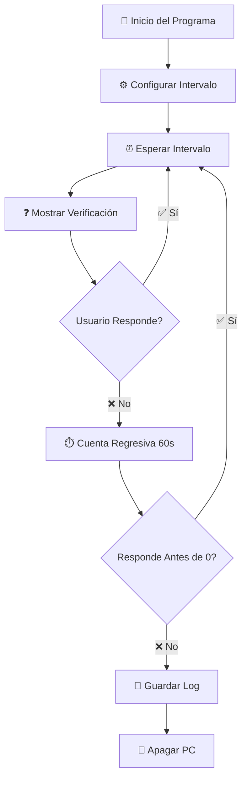

<div align="center">

# 🌱 Monitor de Inactividad - Ahorro de Energía 💡

### _¡Cuida el planeta mientras cuidas tu PC!_ 🌍


---

### 🎯 **Propósito Principal**

Este programa fue diseñado para **reducir el consumo energético** de tu ordenador detectando períodos de inactividad y apagándolo automáticamente cuando no está en uso. 

```
💰 Ahorra dinero → 🔌 Reduce consumo → 🌍 Protege el medio ambiente
```

</div>

---

## 📋 Tabla de Contenidos

- [✨ Características](#-características)
- [🎬 Demostración Visual](#-demostración-visual)
- [🔧 Requisitos y Dependencias](#-requisitos-y-dependencias)
- [💻 Instalación](#-instalación)
- [🚀 Uso](#-uso)
- [⚙️ Configuración](#️-configuración)
- [📊 Registro de Apagados (Sistema de Logs)](#-registro-de-apagados-sistema-de-logs) ⭐ **¡MEJORADO!**
- [🌟 Beneficios Ambientales](#-beneficios-ambientales)
- [❓ Preguntas Frecuentes](#-preguntas-frecuentes)
- [🤝 Contribuir](#-contribuir)
- [📜 Licencia](#-licencia)

---

## ✨ Características

<table>
<tr>
<td width="50%">

### 🎨 Interfaz Moderna
- Diseño oscuro con acentos dorados
- Ventanas centradas automáticamente
- Bordes brillantes y animaciones visuales
- Interfaz intuitiva y fácil de usar

</td>
<td width="50%">

### ⚡ Funcionalidad Inteligente
- Intervalos de verificación personalizables
- Cuenta regresiva visual de 60 segundos
- Sistema de alertas progresivas
- **Registro automático de apagados** 📝

</td>
</tr>
<tr>
<td width="50%">

### 🔒 Seguridad
- Confirmación antes del apagado
- Opción de cancelación en cualquier momento
- No requiere permisos de administrador
- **Logs detallados de actividad** 📋

</td>
<td width="50%">

### 🌿 Ecológico
- Reduce consumo eléctrico innecesario
- Previene el sobrecalentamiento del PC
- Extiende la vida útil del hardware
- Contribuye a reducir tu huella de carbono

</td>
</tr>
</table>

---

## 🎬 Demostración Visual

### 📸 Capturas de Pantalla

#### 🔸 Ventana de Configuración Inicial
```
┌─────────────────────────────────────────────┐
│  ⚙️  Configuración del Monitor              │
│                                              │
│  Ingrese el intervalo en minutos para       │
│  verificaciones:                             │
│  (ej., 15 para cada 15 minutos)             │
│                                              │
│            ┌──────────┐                      │
│            │    30    │                      │
│            └──────────┘                      │
│                                              │
│    [Iniciar Monitor]  [Salir]               │
└─────────────────────────────────────────────┘
```

#### 🔸 Ventana de Verificación de Actividad
```
┌─────────────────────────────────────────────┐
│              ¿Sigues ahí?  👀                 │
│                                              │
│   ¡El ordenador se apagará si no respondes!  │
│                                              │
│                  60 ⏱️                       │
│                                              │
│         [¡Sí, estoy aquí!] 💛                │
│                                              │
│              [Salir] 🔴                      │
└─────────────────────────────────────────────┘
```

### 🎭 Flujo de Funcionamiento



---

## 🔧 Requisitos y Dependencias

### 🐍 Python

```python
# Versión mínima requerida
Python 3.7 o superior
```

### 📦 Bibliotecas Necesarias

El programa utiliza **únicamente bibliotecas estándar de Python**, por lo que **NO necesitas instalar paquetes adicionales**:

| Biblioteca | Versión | Propósito | Incluida en Python |
|------------|---------|-----------|-------------------|
| `tkinter` | ✓ | Interfaz gráfica (GUI) | ✅ Sí |
| `time` | ✓ | Manejo de temporizadores | ✅ Sí |
| `os` | ✓ | Operaciones del sistema | ✅ Sí |
| `sys` | ✓ | Funciones del sistema | ✅ Sí |
| `threading` | ✓ | Hilos para temporizador | ✅ Sí |
| `datetime` | ✓ | Registro de fechas/horas | ✅ Sí |

> 🎉 **¡Ventaja!** No necesitas ejecutar `pip install` para nada. Todo viene incluido con Python.

### 💻 Sistema Operativo

```
🪟 Windows 7 / 8 / 10 / 11
```

> ⚠️ **Nota:** Este programa está diseñado específicamente para Windows, ya que utiliza el comando `shutdown` de Windows.

---

## 💻 Instalación

### 📥 Opción 1: Descarga Directa

1. **Descarga el archivo:**
   ```bash
   # Clona el repositorio o descarga el archivo directamente
   git clone https://github.com/SteveKoko/Script-python-Proyecto-con-la-Universidad.git
   cd Script-python-Proyecto-con-la-Universidad
   ```

2. **Verifica que tienes Python instalado:**
   ```bash
   python --version
   ```
   Deberías ver algo como: `Python 3.x.x`

3. **¡Listo para usar!** 🎉

### 📥 Opción 2: Ejecutable (Próximamente)

Estamos trabajando en una versión ejecutable (`.exe`) que no requiere Python instalado.

---

## 🚀 Uso

### 🎯 Ejecución Básica

1. **Abre la terminal o símbolo del sistema** en la carpeta del programa

2. **Ejecuta el script:**
   ```bash
   python script.py
   ```

3. **Configura el intervalo:**
   - Se abrirá una ventana solicitando el intervalo en minutos
   - Ingresa un número entre **1** y **1440** (24 horas)
   - Ejemplo: `30` para verificar cada 30 minutos

4. **Haz clic en "Iniciar Monitor"** 🟢

5. **El programa ahora está activo:**
   - Esperará el tiempo configurado
   - Mostrará una alerta preguntando si sigues ahí
   - Si respondes, el ciclo continúa
   - Si no respondes en 60 segundos, **el PC se apagará y se registrará en el log** 📝

### 🛑 Detener el Programa

Puedes detener el programa de dos formas:

1. **Haciendo clic en "Salir"** en cualquier ventana
2. **Presionando `Ctrl + C`** en la terminal

---

## ⚙️ Configuración

### ⏰ Intervalos Recomendados

| Situación | Intervalo Sugerido | Uso Ideal |
|-----------|-------------------|-----------|
| 🏢 Oficina | 15-30 minutos | Trabajo con pausas frecuentes |
| 🏠 Casa | 30-60 minutos | Uso doméstico general |
| 🌙 Nocturno | 10-15 minutos | Descargas o tareas nocturnas |
| 🎮 Gaming | 60-120 minutos | Sesiones largas de juego |

---

## 📊 Registro de Apagados (Sistema de Logs)

<div align="center">

```
╔════════════════════════════════════════════════════╗
║     📝 SISTEMA INTELIGENTE DE REGISTRO DE LOGS     ║
║           ¡Nunca pierdas el rastro! 🕵️            ║
╚════════════════════════════════════════════════════╝
```

</div>

### 🎯 ¿Qué es el Sistema de Logs?

El **Sistema de Registro de Apagados** es una funcionalidad incorporada que automáticamente **registra cada vez que el ordenador se apaga** por inactividad. Esto te permite:

- 📈 **Rastrear** cuántas veces se ha apagado tu PC
- 📅 **Analizar** patrones de uso y tiempos de inactividad
- 💡 **Optimizar** los intervalos de verificación
- 🔍 **Auditar** el comportamiento del sistema
- 💾 **Mantener** un historial permanente

---

### 🏗️ Arquitectura del Sistema de Logs

```
┌─────────────────────────────────────────────────────────────┐
│                  FLUJO DEL SISTEMA DE LOGS                  │
└─────────────────────────────────────────────────────────────┘

    Inicio del Programa
           │
           ▼
    ┌──────────────────────┐
    │  __init__()          │
    │  Inicializar Sistema │
    └──────────┬───────────┘
               │
               ├──► 1️⃣ Detectar directorio ProgramData
               │       └─► C:\ProgramData
               │
               ├──► 2️⃣ Crear carpeta InactivityMonitor
               │       └─► C:\ProgramData\InactivityMonitor
               │
               └──► 3️⃣ Definir archivo de log
                       └─► C:\ProgramData\InactivityMonitor\apagados_log.txt

    ⏰ Tiempo de inactividad detectado
           │
           ▼
    ┌──────────────────────┐
    │  log_shutdown()      │ ◄── Función que guarda el registro
    └──────────┬───────────┘
               │
               ├──► 1️⃣ Obtener timestamp actual
               │       └─► datetime.now().strftime("%Y-%m-%d %H:%M:%S")
               │
               ├──► 2️⃣ Abrir archivo en modo append ('a')
               │       └─► Añade sin borrar datos anteriores
               │
               ├──► 3️⃣ Escribir línea de log
               │       └─► [2026-01-27 14:30:45] Apagado automático...
               │
               └──► 4️⃣ Cerrar archivo automáticamente
                       └─► Garantiza integridad de datos

           ▼
    ┌──────────────────────┐
    │  shutdown_computer() │
    └──────────────────────┘
```

---

### 📂 Ubicaciones de Almacenamiento

El sistema implementa un **mecanismo de respaldo inteligente** con dos ubicaciones posibles:

#### 🥇 Ubicación Principal (Prioridad 1)

```
═══════════════════════════════════════════════════════════════
🎯 UBICACIÓN PRINCIPAL
═══════════════════════════════════════════════════════════════

📍 Ruta Completa:
   C:\ProgramData\InactivityMonitor\apagados_log.txt

📂 Estructura de Carpetas:
   C:\
   └── ProgramData\
       └── InactivityMonitor\  ◄── Carpeta del programa
           └── apagados_log.txt ◄── Archivo de log

✅ Ventajas:
   • Accesible para todos los usuarios del sistema
   • Ubicación estándar para datos de aplicaciones
   • No se borra con actualizaciones del programa
   • Persiste entre sesiones de usuario

⚙️ Variables de Entorno Utilizadas:
   os.environ.get('PROGRAMDATA', 'C:\\ProgramData')
   
   └─► Detecta automáticamente la ubicación de ProgramData
       en diferentes versiones de Windows
═══════════���═══════════════════════════════════════════════════
```

#### 🥈 Ubicación de Respaldo (Fallback)

```
═══════════════════════════════════════════════════════════════
🔄 UBICACIÓN DE RESPALDO (FALLBACK)
═══════════════════════════════════════════════════════════════

📍 Ruta:
   [Carpeta donde está script.py]\apagados_log.txt

📂 Ejemplo:
   C:\Users\TuUsuario\Desktop\Monitor\
   └── script.py
   └── apagados_log.txt  ◄── Se crea aquí si falla ProgramData

⚠️ Cuándo se usa:
   • Si no hay permisos para crear carpeta en ProgramData
   • Si la variable PROGRAMDATA no está definida
   • Si ocurre cualquier error al crear el directorio

🔧 Implementación en el Código:
   try:
       os.makedirs(self.log_dir, exist_ok=True)
   except Exception as e:
       print(f"No se pudo crear el directorio de logs: {e}")
       # FALLBACK: Usa el directorio del script
       self.log_dir = os.path.dirname(os.path.abspath(__file__))
═══════════════════════════════════════════════════════════════
```

#### 🔍 Cómo Encontrar tu Archivo de Log

```powershell
# Método 1: Explorador de Windows
1. Presiona Win + R
2. Escribe: %PROGRAMDATA%
3. Busca la carpeta "InactivityMonitor"

# Método 2: Símbolo del Sistema
1. Abre CMD
2. Ejecuta: cd %PROGRAMDATA%\InactivityMonitor
3. Ejecuta: dir apagados_log.txt

# Método 3: PowerShell
Get-Content "C:\ProgramData\InactivityMonitor\apagados_log.txt"
```

---

### 📄 Formato del Archivo de Log

#### 🎨 Estructura de una Entrada

```
┌────────────────────────────────────────────────────────┐
│              ANATOMÍA DE UNA LÍNEA DE LOG              │
└────────────────────────────────────────────────────────┘

[2026-01-27 14:30:45] Apagado automático por inactividad
 └──────┬──────┘ └─┬─┘ └────────────┬────────────────┘
        │          │                 │
        │          │                 └──► Mensaje descriptivo
        │          │
        │          └────────────────────► Hora (HH:MM:SS)
        │
        └───────────────────────────────► Fecha (YYYY-MM-DD)

═══════════════════════════════════════════════════════════

🔤 Formato de Timestamp:
   "%Y-%m-%d %H:%M:%S"
   
   Componentes:
   • %Y = Año (4 dígitos)     → 2026
   • %m = Mes (2 dígitos)     → 01
   • %d = Día (2 dígitos)     → 27
   • %H = Hora (00-23)        → 14
   • %M = Minuto (00-59)      → 30
   • %S = Segundo (00-59)     → 45

💬 Mensaje Estándar:
   "Apagado automático por inactividad"
   • Texto fijo y consistente
   • Fácil de buscar y filtrar
   • Idioma: Español
```

#### 📖 Ejemplo de Archivo Real

````txt
═══════════════════════════════════════════════════════════
📄 apagados_log.txt - EJEMPLO REAL
═══════════════════════════════════════════════════════════

[2026-01-20 09:15:33] Apagado automático por inactividad
[2026-01-20 14:30:22] Apagado automático por inactividad
[2026-01-20 18:45:10] Apagado automático por inactividad
[2026-01-21 10:22:55] Apagado automático por inactividad
[2026-01-21 13:40:18] Apagado automático por inactividad
[2026-01-22 08:55:42] Apagado automático por inactividad
[2026-01-22 17:10:05] Apagado automático por inactividad
[2026-01-23 11:25:30] Apagado automático por inactividad
[2026-01-24 15:50:12] Apagado automático por inactividad
[2026-01-25 12:05:48] Apagado automático por inactividad

═══════════════════════════════════════════════════════════

📊 Análisis de este Log:
   • Total de apagados: 10
   • Período: 6 días (20-25 enero)
   • Promedio: ~1.7 apagados por día
   • Horarios más comunes: Tarde (14:00-18:00)

💡 Interpretación:
   El usuario tiende a dejar el PC encendido durante las
   tardes, lo que indica que podría optimizar el intervalo
   de verificación en ese horario.
