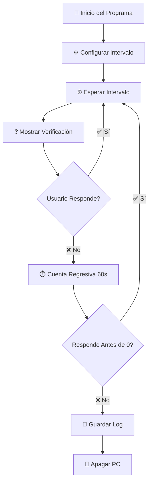

<div align="center">

# 🌱 Monitor de Inactividad - Ahorro de Energía 💡

### _¡Cuida el planeta mientras cuidas tu PC!_ 🌍


---

### 🎯 **Propósito Principal**

Este programa fue diseñado para **reducir el consumo energético** de tu ordenador detectando períodos de inactividad y apagándolo automáticamente cuando no está en uso. 

```
💰 Ahorra dinero → 🔌 Reduce consumo → 🌍 Protege el medio ambiente
```

</div>

---

## 📋 Tabla de Contenidos

- [✨ Características](#-características)
- [🎬 Demostración Visual](#-demostración-visual)
- [🔧 Requisitos y Dependencias](#-requisitos-y-dependencias)
- [💻 Instalación](#-instalación)
- [🚀 Uso](#-uso)
- [⚙️ Configuración](#️-configuración)
- [📊 Registro de Apagados (Sistema de Logs)](#-registro-de-apagados-sistema-de-logs) ⭐ **¡MEJORADO!**
- [🌟 Beneficios Ambientales](#-beneficios-ambientales)
- [❓ Preguntas Frecuentes](#-preguntas-frecuentes)
- [🤝 Contribuir](#-contribuir)
- [📜 Licencia](#-licencia)

---

## ✨ Características

<table>
<tr>
<td width="50%">

### 🎨 Interfaz Moderna
- Diseño oscuro con acentos dorados
- Ventanas centradas automáticamente
- Bordes brillantes y animaciones visuales
- Interfaz intuitiva y fácil de usar

</td>
<td width="50%">

### ⚡ Funcionalidad Inteligente
- Intervalos de verificación personalizables
- Cuenta regresiva visual de 60 segundos
- Sistema de alertas progresivas
- **Registro automático de apagados** 📝

</td>
</tr>
<tr>
<td width="50%">

### 🔒 Seguridad
- Confirmación antes del apagado
- Opción de cancelación en cualquier momento
- No requiere permisos de administrador
- **Logs detallados de actividad** 📋

</td>
<td width="50%">

### 🌿 Ecológico
- Reduce consumo eléctrico innecesario
- Previene el sobrecalentamiento del PC
- Extiende la vida útil del hardware
- Contribuye a reducir tu huella de carbono

</td>
</tr>
</table>

---

## 🎬 Demostración Visual

### 📸 Capturas de Pantalla

#### 🔸 Ventana de Configuración Inicial
```
┌─────────────────────────────────────────────┐
│  ⚙️  Configuración del Monitor              │
│                                              │
│  Ingrese el intervalo en minutos para       │
│  verificaciones:                             │
│  (ej., 15 para cada 15 minutos)             │
│                                              │
│            ┌──────────┐                      │
│            │    30    │                      │
│            └──────────┘                      │
│                                              │
│    [Iniciar Monitor]  [Salir]               │
└─────────────────────────────────────────────┘
```

#### 🔸 Ventana de Verificación de Actividad
```
┌─────────────────────────────────────────────┐
│              ¿Sigues ahí?  👀                 │
│                                              │
│   ¡El ordenador se apagará si no respondes!  │
│                                              │
│                  60 ⏱️                       │
│                                              │
│         [¡Sí, estoy aquí!] 💛                │
│                                              │
│              [Salir] 🔴                      │
└─────────────────────────────────────────────┘
```

### 🎭 Flujo de Funcionamiento



---

## 🔧 Requisitos y Dependencias

### 🐍 Python

```python
# Versión mínima requerida
Python 3.7 o superior
```

### 📦 Bibliotecas Necesarias

El programa utiliza **únicamente bibliotecas estándar de Python**:

| Biblioteca | Versión | Propósito | Incluida en Python |
|------------|---------|-----------|-------------------|
| `tkinter` | ✓ | Interfaz gráfica (GUI) | ✅ Sí* |
| `time` | ✓ | Manejo de temporizadores | ✅ Sí |
| `os` | ✓ | Operaciones del sistema | ✅ Sí |
| `sys` | ✓ | Funciones del sistema | ✅ Sí |
| `threading` | ✓ | Hilos para temporizador | ✅ Sí |
| `datetime` | ✓ | Registro de fechas/horas | ✅ Sí |

> **\*Nota sobre tkinter:** En Windows y macOS viene preinstalado con Python. En Linux puede requerir instalación manual (el script de instalación lo hace automáticamente).

### 💻 Sistema Operativo

```
🪟 Windows 7 / 8 / 10 / 11
🐧 Linux (Ubuntu, Debian, Fedora, Arch, etc.)
🍎 macOS
```

> ⚠️ **Nota:** El comando de apagado es específico para Windows. En Linux/Mac el sistema de monitoreo funciona, pero el apagado automático requiere adaptación.

---

## 💻 Instalación

### 🚀 Instalación Rápida (Recomendada)

Hemos creado scripts de instalación automática que verifican e instalan todas las dependencias necesarias.

#### 🪟 Windows

1. **Clona o descarga el repositorio:**
   ```bash
   git clone https://github.com/SteveKoko/Script-python-Proyecto-con-la-Universidad.git
   cd Script-python-Proyecto-con-la-Universidad
   ```

2. **Ejecuta el instalador:**
   ```bash
   install.bat
   ```
   
   El script automáticamente:
   - ✅ Verifica que Python esté instalado
   - ✅ Comprueba que tkinter esté disponible
   - ✅ Instala tkinter si es necesario
   - ✅ Confirma que todo funcione correctamente

3. **¡Listo!** Ahora puedes ejecutar el programa.

#### 🐧 Linux / 🍎 macOS

1. **Clona o descarga el repositorio:**
   ```bash
   git clone https://github.com/SteveKoko/Script-python-Proyecto-con-la-Universidad.git
   cd Script-python-Proyecto-con-la-Universidad
   ```

2. **Da permisos de ejecución al instalador:**
   ```bash
   chmod +x install.sh
   ```

3. **Ejecuta el instalador:**
   ```bash
   ./install.sh
   ```
   
   El script automáticamente:
   - ✅ Detecta tu sistema operativo
   - ✅ Verifica que Python3 esté instalado
   - ✅ Detecta tu distribución (Ubuntu, Fedora, Arch, etc.)
   - ✅ Instala python3-tk usando el gestor de paquetes correcto
   - ✅ Confirma que todo funcione correctamente

4. **¡Listo!** Ahora puedes ejecutar el programa.

---

### 📥 Instalación Manual (Alternativa)

Si prefieres instalar manualmente o el script automático no funciona:

#### 🪟 Windows

1. **Instala Python:**
   - Descarga desde [python.org](https://www.python.org/downloads/)
   - Durante la instalación, marca "Add Python to PATH"
   - `tkinter` viene incluido automáticamente

2. **Verifica la instalación:**
   ```bash
   python --version
   python -m tkinter
   ```

3. **Descarga el script:**
   ```bash
   git clone https://github.com/SteveKoko/Script-python-Proyecto-con-la-Universidad.git
   ```

#### 🐧 Linux (Ubuntu/Debian)

```bash
# Instalar Python y tkinter
sudo apt-get update
sudo apt-get install python3 python3-tk

# Verificar instalación
python3 --version
python3 -m tkinter

# Descargar el script
git clone https://github.com/SteveKoko/Script-python-Proyecto-con-la-Universidad.git
```

#### 🐧 Linux (Fedora/RHEL)

```bash
# Instalar Python y tkinter
sudo dnf install python3 python3-tkinter

# Verificar instalación
python3 --version
python3 -m tkinter

# Descargar el script
git clone https://github.com/SteveKoko/Script-python-Proyecto-con-la-Universidad.git
```

#### 🐧 Linux (Arch)

```bash
# Instalar Python y tkinter
sudo pacman -S python tk

# Verificar instalación
python --version
python -m tkinter

# Descargar el script
git clone https://github.com/SteveKoko/Script-python-Proyecto-con-la-Universidad.git
```

#### 🍎 macOS

```bash
# Si usas Python de python.org, tkinter viene incluido

# Si usas Homebrew:
brew install python-tk

# Verificar instalación
python3 --version
python3 -m tkinter

# Descargar el script
git clone https://github.com/SteveKoko/Script-python-Proyecto-con-la-Universidad.git
```

---

## 🚀 Uso

### 🎯 Tutorial de Ejecución Paso a Paso

#### Paso 1: Navega a la carpeta del proyecto

```bash
cd Script-python-Proyecto-con-la-Universidad
```

#### Paso 2: Ejecuta el script

**En Windows:**
```bash
python script.py
```

**En Linux/macOS:**
```bash
python3 script.py
```

#### Paso 3: Configura el intervalo

1. Se abrirá una ventana de configuración con fondo oscuro y borde dorado
2. Ingresa el intervalo en minutos (ejemplo: `30` para 30 minutos)
3. Haz clic en "Iniciar Monitor"

   ```
   Valores recomendados:
   - 15 minutos: Para uso en oficina
   - 30 minutos: Para uso doméstico
   - 60 minutos: Para sesiones largas
   ```

#### Paso 4: El monitor está activo

El programa ahora está funcionando en segundo plano:

1. **Esperará** el tiempo configurado
2. **Mostrará una alerta** preguntando "¿Sigues ahí?"
3. **Tienes 60 segundos** para responder
4. Si respondes:
   - ✅ El ciclo continúa
   - El temporizador se reinicia
5. Si NO respondes:
   - 💾 Se guarda un registro en el log
   - 🔌 El PC se apaga automáticamente

#### Paso 5: Ver los registros (Opcional)

**En Windows:**
```powershell
# Abrir el archivo de log
notepad %PROGRAMDATA%\InactivityMonitor\apagados_log.txt

# O navegar en el explorador
Win + R → %PROGRAMDATA%\InactivityMonitor
```

**En Linux/macOS:**
```bash
# Si el script está en el directorio actual
cat apagados_log.txt

# O buscar en ProgramData
find ~ -name "apagados_log.txt"
```

### 🛑 Detener el Programa

Tienes tres opciones para detener el monitor:

1. **Método 1:** Haz clic en el botón "Salir" en cualquier ventana
2. **Método 2:** Presiona `Ctrl + C` en la terminal
3. **Método 3:** Cierra la ventana de terminal/consola

---

### 💡 Consejos de Uso

| 💡 Consejo | Descripción |
|-----------|-------------|
| **Prueba primero** | Empieza con un intervalo corto (5 min) para familiarizarte |
| **Ajusta según necesites** | Cambia el intervalo según tus hábitos de uso |
| **Revisa los logs** | Analiza cuándo se apaga más tu PC para optimizar |
| **Úsalo de noche** | Perfecto para descargas nocturnas que terminan |
| **Ahorro inmediato** | Notarás la reducción en tu factura eléctrica |

---

## ⚙️ Configuración

### ⏰ Intervalos Recomendados

| Situación | Intervalo Sugerido | Uso Ideal |
|-----------|-------------------|-----------|
| 🏢 Oficina | 15-30 minutos | Trabajo con pausas frecuentes |
| 🏠 Casa | 30-60 minutos | Uso doméstico general |
| 🌙 Nocturno | 10-15 minutos | Descargas o tareas nocturnas |
| 🎮 Gaming | 60-120 minutos | Sesiones largas de juego |

---

## 📊 Registro de Apagados (Sistema de Logs)

<div align="center">

```
╔════════════════════════════════════════════════════╗
║     📝 SISTEMA INTELIGENTE DE REGISTRO DE LOGS     ║
║           ¡Nunca pierdas el rastro! 🕵️            ║
╚════════════════════════════════════════════════════╝
```

</div>

### 🎯 ¿Qué es el Sistema de Logs?

El **Sistema de Registro de Apagados** es una funcionalidad incorporada que automáticamente **registra cada vez que el ordenador se apaga** por inactividad. Esto te permite:

- 📈 **Rastrear** cuántas veces se ha apagado tu PC
- 📅 **Analizar** patrones de uso y tiempos de inactividad
- 💡 **Optimizar** los intervalos de verificación
- 🔍 **Auditar** el comportamiento del sistema
- 💾 **Mantener** un historial permanente

---

### 🏗️ Arquitectura del Sistema de Logs

```
┌─────────────────────────────────────────────────────────────┐
│                  FLUJO DEL SISTEMA DE LOGS                  │
└─────────────────────────────────────────────────────────────┘

    Inicio del Programa
           │
           ▼
    ┌──────────────────────┐
    │  __init__()          │
    │  Inicializar Sistema │
    └──────────┬───────────┘
               │
               ├──► 1️⃣ Detectar directorio ProgramData
               │       └─► C:\ProgramData
               │
               ├──► 2️⃣ Crear carpeta InactivityMonitor
               │       └─► C:\ProgramData\InactivityMonitor
               │
               └──► 3️⃣ Definir archivo de log
                       └─► C:\ProgramData\InactivityMonitor\apagados_log.txt

    ⏰ Tiempo de inactividad detectado
           │
           ▼
    ┌──────────────────────┐
    │  log_shutdown()      │ ◄── Función que guarda el registro
    └──────────┬───────────┘
               │
               ├──► 1️⃣ Obtener timestamp actual
               │       └─► datetime.now().strftime("%Y-%m-%d %H:%M:%S")
               │
               ├──► 2️⃣ Abrir archivo en modo append ('a')
               │       └─► Añade sin borrar datos anteriores
               │
               ├──► 3️⃣ Escribir línea de log
               │       └─► [2026-01-27 14:30:45] Apagado automático...
               │
               └──► 4️⃣ Cerrar archivo automáticamente
                       └─► Garantiza integridad de datos

           ▼
    ┌──────────────────────┐
    │  shutdown_computer() │
    └──────────────────────┘
```

---

### 📂 Ubicaciones de Almacenamiento

El sistema implementa un **mecanismo de respaldo inteligente** con dos ubicaciones posibles:

#### 🥇 Ubicación Principal (Prioridad 1)

```
═══════════════════════════════════════════════════════════════
🎯 UBICACIÓN PRINCIPAL
═══════════════════════════════════════════════════════════════

📍 Ruta Completa:
   C:\ProgramData\InactivityMonitor\apagados_log.txt

📂 Estructura de Carpetas:
   C:\
   └── ProgramData\
       └── InactivityMonitor\  ◄── Carpeta del programa
           └── apagados_log.txt ◄── Archivo de log

✅ Ventajas:
   • Accesible para todos los usuarios del sistema
   • Ubicación estándar para datos de aplicaciones
   • No se borra con actualizaciones del programa
   • Persiste entre sesiones de usuario

⚙️ Variables de Entorno Utilizadas:
   os.environ.get('PROGRAMDATA', 'C:\ProgramData')
   
   └─► Detecta automáticamente la ubicación de ProgramData
       en diferentes versiones de Windows
═══════════════════════════════════════════════════════════════
```

#### 🥈 Ubicación de Respaldo (Fallback)

```
═══════════════════════════════════════════════════════════════
🔄 UBICACIÓN DE RESPALDO (FALLBACK)
═══════════════════════════════════════════════════════════════

📍 Ruta:
   [Carpeta donde está script.py]\apagados_log.txt

📂 Ejemplo:
   C:\Users\TuUsuario\Desktop\Monitor\
   └── script.py
   └── apagados_log.txt  ◄── Se crea aquí si falla ProgramData

⚠️ Cuándo se usa:
   • Si no hay permisos para crear carpeta en ProgramData
   • Si la variable PROGRAMDATA no está definida
   • Si ocurre cualquier error al crear el directorio

🔧 Implementación en el Código:
   try:
       os.makedirs(self.log_dir, exist_ok=True)
   except Exception as e:
       print(f"No se pudo crear el directorio de logs: {e}")
       # FALLBACK: Usa el directorio del script
       self.log_dir = os.path.dirname(os.path.abspath(__file__))
═══════════════════════════════════════════════════════════════
```

#### 🔍 Cómo Encontrar tu Archivo de Log

```powershell
# Método 1: Explorador de Windows
1. Presiona Win + R
2. Escribe: %PROGRAMDATA%
3. Busca la carpeta "InactivityMonitor"

# Método 2: Símbolo del Sistema
1. Abre CMD
2. Ejecuta: cd %PROGRAMDATA%\InactivityMonitor
3. Ejecuta: dir apagados_log.txt

# Método 3: PowerShell
Get-Content "C:\ProgramData\InactivityMonitor\apagados_log.txt"
```

---

### 📄 Formato del Archivo de Log

#### 🎨 Estructura de una Entrada

```
┌────────────────────────────────────────────────────────┐
│              ANATOMÍA DE UNA LÍNEA DE LOG              │
└────────────────────────────────────────────────────────┘

[2026-01-27 14:30:45] Apagado automático por inactividad
 └──────┬──────┘ └─┬─┘ └────────────┬────────────────┘
        │          │                 │
        │          │                 └──► Mensaje descriptivo
        │          │
        │          └────────────────────► Hora (HH:MM:SS)
        │
        └───────────────────────────────► Fecha (YYYY-MM-DD)

═══════════════════════════════════════════════════════════

🔤 Formato de Timestamp:
   "%Y-%m-%d %H:%M:%S"
   
   Componentes:
   • %Y = Año (4 dígitos)     → 2026
   • %m = Mes (2 dígitos)     → 01
   • %d = Día (2 dígitos)     → 27
   • %H = Hora (00-23)        → 14
   • %M = Minuto (00-59)      → 30
   • %S = Segundo (00-59)     → 45

💬 Mensaje Estándar:
   "Apagado automático por inactividad"
   • Texto fijo y consistente
   • Fácil de buscar y filtrar
   • Idioma: Español
```

#### 📖 Ejemplo de Archivo Real

```txt
═══════════════════════════════════════════════════════════
📄 apagados_log.txt - EJEMPLO REAL
═══════════════════════════════════════════════════════════

[2026-01-20 09:15:33] Apagado automático por inactividad
[2026-01-20 14:30:22] Apagado automático por inactividad
[2026-01-20 18:45:10] Apagado automático por inactividad
[2026-01-21 10:22:55] Apagado automático por inactividad
[2026-01-21 13:40:18] Apagado automático por inactividad
[2026-01-22 08:55:42] Apagado automático por inactividad
[2026-01-22 17:10:05] Apagado automático por inactividad
[2026-01-23 11:25:30] Apagado automático por inactividad
[2026-01-24 15:50:12] Apagado automático por inactividad
[2026-01-25 12:05:48] Apagado automático por inactividad

═══════════════════════════════════════════════════════════

📊 Análisis de este Log:
   • Total de apagados: 10
   • Período: 6 días (20-25 enero)
   • Promedio: ~1.7 apagados por día
   • Horarios más comunes: Tarde (14:00-18:00)

💡 Interpretación:
   El usuario tiende a dejar el PC encendido durante las
   tardes, lo que indica que podría optimizar el intervalo
   de verificación en ese horario.
```

---

## 🌟 Beneficios Ambientales

### 🌍 Impacto Ecológico

```
╔═══════════════════════════════════════════════════════════╗
║          ¿CUÁNTO PUEDES AHORRAR CON ESTE PROGRAMA?        ║
╚═══════════════════════════════════════════════════════════╝

Ejemplo: PC que se queda encendido 8 horas diarias innecesariamente

💡 Consumo promedio PC: 300W
⏰ Tiempo ahorrado: 8 horas/día
📅 Días al año: 365

CÁLCULO:
300W × 8h × 365 días = 876 kWh/año

💰 AHORRO ECONÓMICO:
876 kWh × €0.15/kWh = €131.40 al año

🌳 EQUIVALENCIA AMBIENTAL:
876 kWh = 438 kg de CO₂
= Plantar 20 árboles al año
= No conducir 1,750 km
= Reciclar 150 kg de plástico

╚═══════════════════════════════════════════════════════════╝
```

---

## ❓ Preguntas Frecuentes

<details>
<summary><b>❓ ¿El programa funciona con el monitor apagado?</b></summary>

No, el programa requiere que respondas activamente a las alertas visuales. Si el monitor está apagado, no podrás ver la alerta de verificación.
</details>

<details>
<summary><b>❓ ¿Puedo usar el programa para apagar solo el monitor?</b></summary>

Actualmente el programa apaga todo el sistema. Para apagar solo el monitor, necesitarías modificar el script reemplazando el comando de apagado por uno que apague solo el monitor.
</details>

<details>
<summary><b>❓ ¿Qué pasa si estoy descargando algo?</b></summary>

El programa te preguntará si sigues ahí. Si respondes, la descarga continuará. Si no respondes y el PC se apaga, la descarga se interrumpirá.
</details>

<details>
<summary><b>❓ ¿Puedo ver cuántas veces se ha apagado mi PC?</b></summary>

Sí, el archivo de log guarda cada apagado automático con fecha y hora. Puedes abrir el archivo `apagados_log.txt` para ver el historial completo.
</details>

<details>
<summary><b>❓ ¿El programa consume muchos recursos?</b></summary>

No, el programa es extremadamente ligero. Usa menos de 50MB de RAM y prácticamente 0% de CPU cuando está en espera.
</details>

<details>
<summary><b>❓ ¿Funciona en laptops?</b></summary>

Sí, funciona perfectamente en laptops. Es especialmente útil cuando están conectados a la corriente.
</details>

---

## 🤝 Contribuir

¿Tienes ideas para mejorar el programa? ¡Las contribuciones son bienvenidas!

1. Haz fork del repositorio
2. Crea una rama para tu característica (`git checkout -b feature/AmazingFeature`)
3. Commit tus cambios (`git commit -m 'Add some AmazingFeature'`)
4. Push a la rama (`git push origin feature/AmazingFeature`)
5. Abre un Pull Request

---

## 📜 Licencia

Este proyecto está bajo la Licencia MIT. Ver el archivo `LICENSE` para más detalles.

---

<div align="center">

### 💚 Hecho con amor por el planeta 🌍

**Cada pequeña acción cuenta. ¡Gracias por hacer tu parte!**

[](https://github.com/SteveKoko/Script-python-Proyecto-con-la-Universidad/stargazers)
[](https://github.com/SteveKoko/Script-python-Proyecto-con-la-Universidad/network/members)

</div>